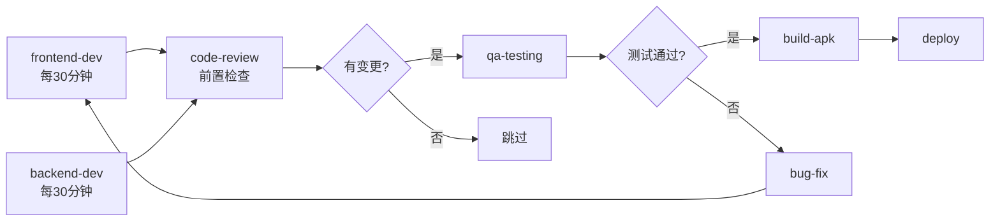

# JUJU App 工作流设计 v2.0

**设计日期**: 2026-05-03
**设计者**: 扎克 (Hermes)
**目标**: 解决历史问题，建立高效、稳定、可扩展的多Agent协作工作流

---

## 一、历史问题总结

### 1. 任务超时问题
- **原因**: 任务设计过于复杂，单次执行内容过多
- **表现**: self-evolution-active 连续5次超时，resource-monitoring-core 超时
- **解决**: 遵循"先轻量预检，再深度检查"原则

### 2. Rate Limit 问题
- **原因**: 多个任务同时整点执行，触发API限流
- **表现**: conversation-learning-engine 被禁用
- **解决**: 错峰调度，增加 staggerMs

### 3. 任务空转问题
- **原因**: 检查类任务频率过高，但无新代码提交时仍在运行
- **表现**: 每小时执行 code-review/qa-testing/bug-fix，浪费Token
- **解决**: 增加前置条件检查，无变化时跳过

### 4. 开发Agent暂停问题
- **原因**: 前端/API开发Agent自4月25日暂停，原因不明
- **表现**: 只有检查类任务运行，无推进开发
- **解决**: 建立开发→检查→测试→部署完整流水线

### 5. 部署问题
- **原因**: Render部署任务暂停，且Render可能已不用
- **表现**: juju-deploy-render 任务暂停于4月28日
- **解决**: 确认部署目标，重新激活部署任务

---

## 二、工作流设计原则

### 核心原则
1. **防御性降级**: 服务故障时自动切换为日志输出
2. **三阶段修复**: 分析→修复→沉淀（记录到知识库）
3. **配置漂移防护**: 定期检查配置一致性
4. **轻量预检**: 复杂任务前先快速检查必要性
5. **错峰调度**: 避免任务同时触发

### Token 优化原则
- 无代码变更时跳过检查类任务
- 合并相似任务（如 code-review + bug-fix）
- 使用本地模型处理简单任务

---

## 三、工作流架构

### 3.1 分层架构

```
┌─────────────────────────────────────────┐
│           协调层 (Coordinator)           │
│  - 任务调度、冲突检测、资源分配            │
├─────────────────────────────────────────┤
│           执行层 (Executors)              │
│  - 前端开发、后端开发、UI改造、测试        │
├─────────────────────────────────────────┤
│           检查层 (Monitors)               │
│  - 代码审查、安全扫描、性能监控            │
├─────────────────────────────────────────┤
│           部署层 (Deployers)              │
│  - 构建、测试、部署、回滚                  │
└─────────────────────────────────────────┘
```

### 3.2 任务分类

| 类型 | 任务示例 | 频率 | 触发条件 |
|------|---------|------|---------|
| **开发类** | frontend-dev, backend-dev, ui-refactor | 每30分钟 | 持续运行 |
| **检查类** | code-review, security-scan | 每6小时 | 有代码提交时 |
| **测试类** | qa-testing, e2e-test | 每6小时 | 开发任务完成后 |
| **部署类** | build-apk, deploy | 每2小时 | 测试通过后 |
| **监控类** | zombie-monitor, health-check | 每30分钟 | 持续运行 |
| **报告类** | daily-report | 每天 | 定时触发 |

---

## 四、具体任务设计

### 4.1 开发流水线（核心）



### 4.2 任务详细配置

#### 1. juju-frontend-dev（前端开发）
```yaml
schedule: "*/30 * * * *"
timeout: 1800s
pre_check:
  - git diff --name-only  # 检查是否有变更
  - check_dependencies   # 检查依赖是否完整
fallback:
  - action: log_only      # 超时或失败时只记录日志
  - retry: 2              # 最多重试2次
```

#### 2. juju-backend-dev（后端开发）
```yaml
schedule: "*/30 * * * *"
timeout: 1800s
pre_check:
  - git diff --name-only
  - check_db_connection  # 检查数据库连接
fallback:
  - action: log_only
  - retry: 2
```

#### 3. juju-code-review（代码审查）
```yaml
schedule: "0 */6 * * *"    # 每6小时
timeout: 3600s
pre_check:
  - git log --since="6 hours ago"  # 检查6小时内是否有提交
  - if_no_commits: skip            # 无提交则跳过
conditions:
  - execute_only_if: new_commits   # 只有新提交时才执行
```

#### 4. juju-qa-testing（UX测试）
```yaml
schedule: "0 */6 * * *"
timeout: 3600s
pre_check:
  - check_last_build_status       # 检查上次构建状态
  - if_build_failed: skip         # 构建失败则跳过
conditions:
  - execute_only_if: build_success
```

#### 5. juju-bug-fix（Bug修复）
```yaml
schedule: "0 */6 * * *"
timeout: 3600s
pre_check:
  - check_bug_list                # 检查待修复Bug列表
  - if_no_bugs: skip              # 无Bug则跳过
conditions:
  - execute_only_if: bugs_exist
```

#### 6. juju-build-apk（构建APK）
```yaml
schedule: "0 */2 * * *"           # 每2小时
timeout: 3600s
pre_check:
  - check_code_review_passed      # 检查代码审查是否通过
  - check_qa_passed               # 检查测试是否通过
conditions:
  - execute_only_if: review_passed AND qa_passed
```

#### 7. juju-deploy（部署）
```yaml
schedule: "0 */2 * * *"
timeout: 1800s
pre_check:
  - check_build_success           # 检查构建是否成功
  - check_deploy_target           # 检查部署目标可用性
conditions:
  - execute_only_if: build_success
```

#### 8. juju-admin-web-dev（管理后台）
```yaml
schedule: "*/30 * * * *"
timeout: 1800s
pre_check:
  - check_frontend_changes        # 检查前端是否有变更
```

#### 9. juju-mp-weixin-dev（微信小程序）
```yaml
schedule: "*/30 * * * *"
timeout: 1800s
pre_check:
  - check_api_changes             # 检查API是否有变更
```

#### 10. juju-website-dev（官网）
```yaml
schedule: "*/30 * * * *"
timeout: 1800s
pre_check:
  - check_content_changes         # 检查内容是否有变更
```

---

## 五、协调机制

### 5.1 冲突避免

| 时间窗口 | 执行任务 | 说明 |
|---------|---------|------|
| :00-:05 | frontend-dev, backend-dev | 开发类优先 |
| :05-:10 | admin-web, mp-weixin, website | 多端开发 |
| :10-:15 | build-apk, deploy | 构建部署 |
| :15-:20 | code-review, qa-testing | 检查测试 |
| :20-:25 | bug-fix | 修复 |
| :25-:30 | zombie-monitor, health-check | 监控 |

### 5.2 依赖管理

```yaml
dependencies:
  juju-build-apk:
    requires:
      - juju-code-review: passed
      - juju-qa-testing: passed
  
  juju-deploy:
    requires:
      - juju-build-apk: success
  
  juju-bug-fix:
    triggers:
      - juju-code-review: found_bugs
      - juju-qa-testing: found_bugs
```

### 5.3 失败处理

```yaml
failure_handling:
  timeout:
    - increase_timeout: 1.5x
    - retry: 2
    - if_still_fails: log_only
  
  rate_limit:
    - backoff: 600s
    - switch_to: local_model
    - notify: true
  
  api_error:
    - retry: 3
    - fallback: log_output
    - escalate: true
```

---

## 六、监控与告警

### 6.1 监控指标

| 指标 | 阈值 | 告警方式 |
|------|------|---------|
| 任务成功率 | < 90% | 飞书消息 |
| 平均执行时间 | > 2x 预期 | 日志警告 |
| Token 消耗 | > 1.5x 预期 | 日报统计 |
| 连续失败次数 | > 3次 | 立即告警 |

### 6.2 自愈机制

```yaml
self_healing:
  - condition: task_timeout > 3
    action: increase_timeout_and_retry
  
  - condition: rate_limit_triggered
    action: switch_to_backup_provider
  
  - condition: service_unavailable
    action: degrade_to_log_only
  
  - condition: config_drift_detected
    action: auto_restore_config
```

---

## 七、知识沉淀

### 7.1 自动记录

每次任务执行后自动记录：
- 执行时间、耗时、结果
- 遇到的问题和解决方案
- Token消耗统计
- 代码变更摘要

### 7.2 定期总结

- **每周**: 生成工作周报，统计任务成功率、Token消耗
- **每月**: 生成工作月报，分析趋势，优化调度
- **每季**: 全面审查工作流，更新最佳实践

---

## 八、当前任务列表（13个）

| # | 任务名 | 频率 | 类型 | 状态 |
|---|--------|------|------|------|
| 1 | juju-frontend-dev | 每30分钟 | 开发 | ✅ active |
| 2 | juju-backend-dev | 每30分钟 | 开发 | ✅ active |
| 3 | juju-admin-web-dev | 每30分钟 | 开发 | ✅ active |
| 4 | juju-mp-weixin-dev | 每30分钟 | 开发 | ✅ active |
| 5 | juju-website-dev | 每30分钟 | 开发 | ✅ active |
| 6 | juju-code-review | 每6小时 | 检查 | ✅ active |
| 7 | juju-qa-testing | 每6小时 | 测试 | ✅ active |
| 8 | juju-bug-fix | 每6小时 | 修复 | ✅ active |
| 9 | juju-build-apk | 每2小时 | 构建 | ⏳ 待创建 |
| 10 | juju-deploy | 每2小时 | 部署 | ✅ active |
| 11 | novel-chapter-writing | 每2小时 | 写作 | ✅ active |
| 12 | project-daily-report | 每天9点 | 报告 | ✅ active |
| 13 | zombie-process-monitor | 每30分钟 | 监控 | ✅ active |
| 14 | hermes-self-maintenance | 每天14点 | 维护 | ✅ active |

---

## 九、待办事项

- [ ] 创建 juju-build-apk 任务
- [ ] 配置 pre_check 脚本
- [ ] 测试工作流完整流程
- [ ] 设置监控告警
- [ ] 验证 Token 消耗优化效果

---

**最后更新**: 2026-05-03
**版本**: v2.0
